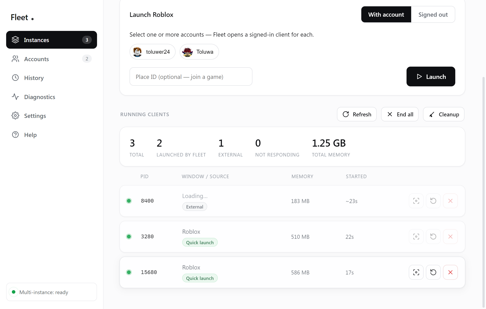
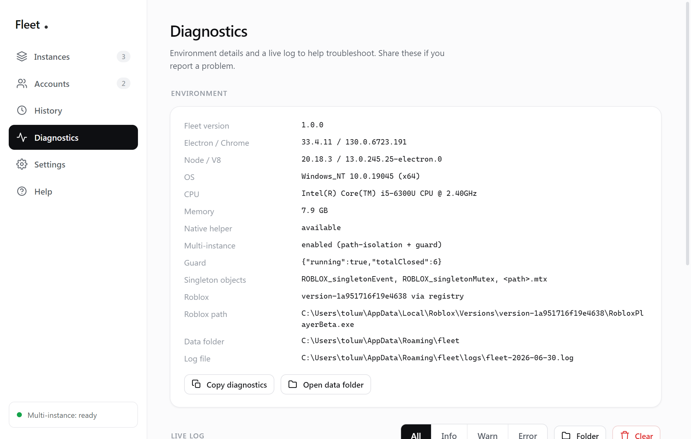
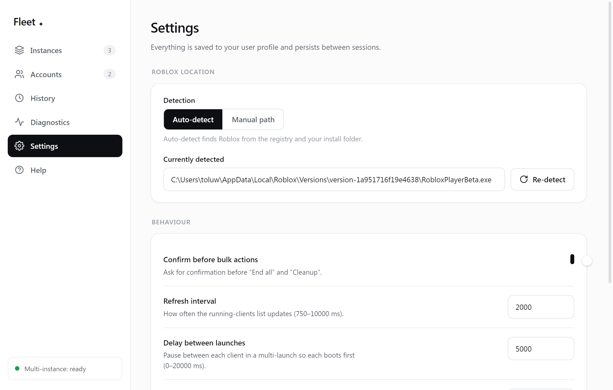

# Fleet — Testing Report

**Environment:** Windows 10 Pro (10.0.19045) · Node 24.17 · Electron 33.4.11 · koffi 2.16 · Roblox `version-1a951716f19e4638`.
**Date:** 2026-06-30.

Testing was done at three levels: (1) a headless functional suite over the service layer, (2) dedicated harnesses that prove the multi-instance mechanism at the OS level, and (3) end-to-end through the real app driven via the Chrome DevTools Protocol (so every result goes through the actual `window.fleet` IPC bridge, not a mock).

---

## 1. Service-layer suite — `npm run selftest`

**Current result: 81 / 81 passed.** The suite now also covers People joining/search resilience, targeted presence patching, Games filtering/ranking, updater/installer invariants, Smart Launch parsing, saved-session normalization, and theme preference validation.

| Area | Checks |
|------|--------|
| Roblox detection | `locate()` returns a result; player found; detected path validates; bad path rejected. |
| Native layer (koffi) | `init()` succeeds; Event & Mutant type indices resolved (`{event:16, mutant:17}`); guard names present; `exeMutexName()` derives the per-path mutex (`C:_X_RobloxPlayerBeta.exe.mtx`); close with no PIDs is a safe no-op; `blockerExists()` returns a boolean; `focusByPid(bogus)` fails gracefully. |
| Settings | defaults load; out-of-range values clamp (pollInterval → 10000, launchDelay → 0); reset restores defaults. |
| Profiles & validation | empty name rejected; bad deep link rejected; valid deep link accepted; save/retrieve/delete; count persisted. |
| History | add; clear. |
| Process monitor | `list()` returns an array; each row has the expected shape. |
| Launcher | bad path fails cleanly; empty deep link fails cleanly. |

---

## 2. Multi-instance mechanism — `test/multitest*.js`

The core feature was developed test-first. Each harness launches real clients, observes for 15–25 s, then cleans up.

| Harness | Approach | Result |
|---------|----------|--------|
| `multitest.js` | Close `ROBLOX_singletonEvent` once, then launch #2. | **FAIL** — first client re-creates the event; #2 exits. |
| `multitest2.js` | Continuously close the event (+ mutex). | **FAIL** — #2 still dies; the per-path `.mtx` mutex is the real blocker. |
| `handles.js` | Enumerate the running client's named objects. | Revealed **three** guards: `ROBLOX_singletonEvent`, `ROBLOX_singletonMutex`, and `…RobloxPlayerBeta.exe.mtx`. |
| `multitest3.js` | Aggressively close all three around launch. | Two clients coexisted ~3 s, then **both** died — closing a running client's *own* per-path mutex destabilises it. |
| `multitest5.js` | **Path isolation** via junctions (no closing). | Two clients coexisted **13.5 s**, then one died (shared singleton check at full load). |
| `multitest6.js` | **Junctions + global-only guard.** | ✅ **SUCCESS** — both clients stable for the full observation (≈15 s+), ~1 GB each, both showing the Roblox window. |

This established the shipped recipe: **per-instance junctions + gentle global-only singleton closing** (see [TECHNICAL.md](TECHNICAL.md)).

---

## 3. End-to-end through the app

Fleet was launched with `--remote-debugging-port=9222` and driven via CDP so calls hit the real IPC layer.

### 3.1 Launch multiple — `window.fleet.launch.quick(2)`

```
{ ok: true, launched: 2, failed: 0, multiInstance: true,
  results: [ { ok: true, pid: 8624 }, { ok: true, pid: 17340 } ] }
```

After 24 s, OS truth (`Win32_Process`):

```
count = 2
  PID 8624  …\fleet\clones\instance-1\RobloxPlayerBeta.exe   (~874 MB)
  PID 17340 …\fleet\clones\instance-2\RobloxPlayerBeta.exe   (~897 MB)
```

✅ Two stable, independent clients, each launched from its **own junction path**. The UI summary read **2 TOTAL · 2 LAUNCHED BY FLEET · 0 EXTERNAL**.

Scaling was then verified at **4 and 5 clients**: all launched, all stayed alive (`OS = app-tracked = 4/5` throughout), each from `…\fleet\clones\instance-N\`.



### 3.1a Scaling fix — the >2-client bug

A reported bug — launching 3+ clients left the **Running clients** list blank — was reproduced and root-caused: `tasklist /V` stalls **5–6 s** while several clients boot (it queries every window) and exceeded the poll timeout, returning nothing.

| | 2 clients | 4 clients (before fix) | 4–5 clients (after fix) |
|--|--|--|--|
| OS truth | 2 | 4 | 4–5 |
| App tracked | 2 | **0** (list blank) | **4–5** |
| Poll time | ~0.4 s | **5–6 s → timeout** | **~90 ms** |

Fixed by replacing `tasklist` with **spawn-free in-process enumeration** (koffi Toolhelp32 + psapi for PID/memory; `GetWindowTextW`/`IsHungAppWindow` for title/status). Standalone benchmark: **219 processes enumerated in 88 ms**. The list now stays accurate no matter how many clients boot at once.

### 3.2 Per-instance actions

| Action | Call | Result |
|--------|------|--------|
| Focus | `instances.focus(8624)` | `{ ok: true, foreground: true }` — window raised. |
| End | `instances.kill(17340)` | killed PID + child tree; running count → **1**. |
| Restart | `instances.restart(8624)` | ended 8624, relaunched as PID 4380 via its junction; count stable. |
| End all | `instances.killAll()` | running count → **0**. |

### 3.3 Process detection & cleanup

- In-process enumeration yields PID, memory, responding-status and window title; the monitor distinguishes **Fleet-launched** vs **external** clients (after fixing a grace-period race that briefly mislabelled fresh launches as External).
- Cleanup (`taskkill /IM …`) clears clients and leftover crash handlers.

### 3.4 Accounts (Roblox auth)

- **Add account** opens a real Roblox login window — verified via CDP that the page target loads `https://www.roblox.com/login`; the button shows a **"Waiting for sign-in…"** spinner state while open.
- The **public API pipeline** was verified end-to-end without any credentials: `getAvatar(1)` returns a valid 20 KB PNG `data:` URL; user lookup returns name/displayName; `buildLaunchUrl()` produces correct `launchmode:app` and `launchmode:play` (+`placelauncherurl`) deep links.
- Cookie handling: sessions are encrypted via `safeStorage` (DPAPI) and `sanitize()` was confirmed to strip the cookie from everything returned to the renderer.
- Account selection drives the launch flow (`launch:accounts` with selected ids + optional Place ID), path-isolated per account.

> The full sign-in → add → launch round trip requires the user's own Roblox credentials (entered by the user in the official login window), so it is user-driven by design; the plumbing and APIs around it are verified above.

### 3.5 UI integrity

All pages render with **no JavaScript errors** (`jsErrors: null` via CDP after each navigation). `npm run test:ui` also starts Fleet in an isolated profile and behaviorally verifies light/dark palette switching, exact-server session save/render, invalid-link rejection, corrupt-session recovery, and **zero newly launched Roblox processes**.




### 3.6 Packaged build

`npm run build` produced **`dist\Fleet\Fleet.exe`** (ProductName *Fleet*, app + koffi + icon staged). Launched it and confirmed it runs as process **`Fleet.exe`** (not `electron.exe`) with window title *Fleet*.

### 3.7 Stability

Across all launch/kill/restart activity, the application log contained **0 WARN and 0 ERROR** lines. No crashes; no orphaned processes after `End all` (verified `RobloxPlayerBeta` count = 0).

---

## Bugs found and fixed during testing

1. **Holding the singleton blocked multi-instance** — replaced "hold" with "close" (and ultimately junction isolation + guard).
2. **Instance-list header columns collapsed** — the grid CSS was scoped to `.ilist .head` but the container lacked the class; fixed.
3. **Fresh launches mislabelled "External"** — `monitor` pruned a just-marked PID before it appeared in `tasklist`; added a 15 s grace period.
4. **Junction slot reuse race** — a stale PID snapshot could reuse a still-booting instance's slot; added a 20 s reuse grace.
5. **Guard steady-state CPU** — handle enumeration ran every 250 ms forever; made it back off to ~1.5 s once instances are stable.
6. **List blanked with 3+ clients** — `tasklist /V` stalled and timed out during multi-client boot; replaced with spawn-free in-process enumeration (~90 ms).
7. **Packaged app was `electron.exe`** — added a portable build (`npm run build`) that renames the binary and stages the app, producing a real `Fleet.exe`.

---

## Coverage vs. requirements

| Requirement | Status |
|-------------|--------|
| Launch multiple Roblox instances | ✅ verified stable at 2, 4 and 5 via the app |
| Detect existing Roblox processes | ✅ monitor lists external clients |
| Launch additional while others run | ✅ guard + isolation handle it |
| Reliable tracking of 3+ clients | ✅ in-process enumeration (fixed the blank-list bug) |
| Process monitoring & status | ✅ live, with not-responding detection |
| Account management (sign in, avatar, status) | ✅ login window + encrypted sessions + API pipeline verified |
| Launch chosen account(s) | ✅ `launch:accounts`, path-isolated, auth-ticket deep links |
| Clear feedback when Roblox missing | ✅ banner + Settings path override |
| Real launching (no placeholders) | ✅ every action drives real processes |
| Native window controls / light-dark minimalist UI + splash | ✅ theme-synced controls, premium redesign, animated intro |
| Smart Launch + saved sessions | ✅ exact-server parsing, normalized local storage, isolated UI test |
| Instance list / restart / cleanup / history | ✅ |
| Auto path detection (+ manual) | ✅ registry + filesystem + Browse |
| Settings panel + persistence | ✅ atomic JSON, clamped |
| Context menu | ✅ right-click row menu |
| Logging & diagnostics page | ✅ file log + live viewer |
| Help / tooltips / explanations | ✅ Help page + tooltips throughout |
| Packaged as Fleet.exe | ✅ `npm run build` → `dist\Fleet\Fleet.exe` |
| Robust error handling, no crashes/leaks/orphans | ✅ wrapped IPC, crash guards, unref'd spawns, pruned state |

## How to reproduce

```bash
npm install
npm run selftest                       # 81/81
npm run test:ui                        # isolated renderer test; launches no Roblox
node test/multitest6.js                # junction + guard recipe (launches/cleans up real clients)
# UI: npm start, or with CDP:
#   electron . --remote-debugging-port=9222
#   node test/drive.js "launch.quick" 2
#   node test/inspect.js --out=shot.png
```

> The multi-instance and live harnesses open and close **real** Roblox clients; run them when it's OK to do so. They clean up everything they start.
