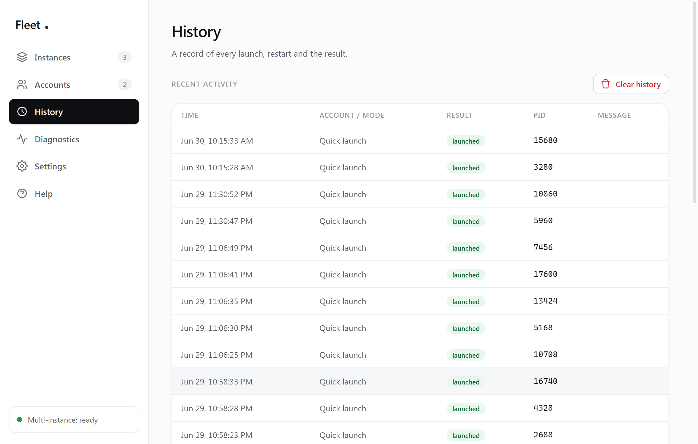

# Fleet — User Guide

A friendly walkthrough. You don't need any technical knowledge to use Fleet, and you don't need to change any Roblox settings.

> Everything here is also available inside the app on the **Help** page.

---

## 1. Open Fleet

Start Fleet from the desktop/Start-menu shortcut (or `npm start` if running from source). You'll land on the **Instances** page.

Check the **Roblox detected** banner near the top. Multi-instance readiness and native-helper details are available on the **Diagnostics** page instead of occupying the navigation rail.

If Roblox wasn't found, see [Troubleshooting](#troubleshooting).

## 2. Add your accounts (optional but recommended)

Go to **Accounts → Add account**. A real Roblox login window opens — sign in (2FA and captcha included; it's the official Roblox page). When you're signed in, Fleet captures the session, closes the window, and your account appears as a card with its avatar, name and presence.

Your session is encrypted with Windows' built-in protection and stored only on this PC. It never leaves your machine and is never shown in the app. Add as many accounts as you like.

## 3. Launch clients

In the **Launch Roblox** card on **Instances**:

**With account** (if you've added any) — select one or more account chips, optionally paste a **Place ID**, Roblox game URL, or exact-server deep link, then click **Launch**. Fleet opens one signed-in client per selected account and preserves the exact server when the link contains one.

**Signed out** — switch the toggle, use the **– / +** stepper to choose how many clients to open, then **Launch**.

Either way, Fleet opens real, separate Roblox clients, waiting a few seconds between each so every one starts cleanly. Each appears in the **Running clients** list below as it comes up, tagged **Fleet** (with the account name when signed in).

> Tip: you can also launch a single account straight from its card on the **Accounts** page, or select several there and use **Launch N selected**.

### Save a launch session

After selecting accounts and an optional game/server target, click **Save current setup** in the **Sessions** card. Give it a name and optionally enable **Auto-arrange windows**. The saved row relaunches that complete setup with one click. It stores only account IDs and the game target locally—not login cookies—and safely ignores accounts you later remove.

## 4. Manage running clients

Each row in **Running clients** shows a status dot (green = running, red = not responding), the **PID**, the window title, memory, and when it started. Hover a row for actions, or **right-click** it for a menu:

| Action | What it does |
|--------|--------------|
| **Focus** | Brings that client's window to the front. |
| **Restart** | Ends the client and launches a fresh one. |
| **End** | Closes just that client. |
| **Copy PID** | (right-click menu) copies the process ID. |

At the top of the list:

- **Refresh** — update the list immediately.
- **End all** — close every Roblox client.
- **Cleanup** — close all clients *and* clear any leftover Roblox crash-handler processes.

The summary strip shows totals: how many are running, how many Fleet launched, how many are external, how many aren't responding, and total memory.

## 5. Manage accounts

On the **Accounts** page each card has:

| Action | What it does |
|--------|--------------|
| **Launch** | Opens one client signed in to that account. |
| **Refresh** (circle icon) | Re-fetches the avatar and presence. |
| **Remove** (trash icon) | Deletes the account and its stored session from this PC. |
| **Select** (the checkbox) | Marks it for a multi-account launch (**Launch N selected**, or **With account** on Instances). |

**Refresh all** updates every account's status at once.

If an account shows **"Session expired"**, click **Sign in again** on that card. Fleet keeps the account saved and never opens a login window by itself.

## 6. Browse & join games

The **Games** page lets you discover Roblox experiences:

- It opens on **popular** games — each card shows the thumbnail, live player count and likes.
- Type in the **search** box and press Enter to search; scroll down to load more results.
- **Refresh** reloads the popular list. **Random Game** picks one from the list and joins it.
- Click **Join** on any card to launch it. Fleet uses your **selected account** (or the first one if none is selected), so you join already signed in. *(Add an account first if you have none.)*

## 7. History

The **History** page lists every launch and restart with a timestamp, the account/mode, the result, and the PID. Use **Clear history** to wipe it.

## 8. Settings

- **Detection** — *Auto-detect* (recommended) or *Manual path* with a **Browse** button if Fleet can't find Roblox. **Re-detect** re-runs detection.
- **Theme** — follow Windows automatically, or force **Light** or **Dark**. The native window buttons update with the selected palette.
- **Confirm before bulk actions** — ask before *End all* / *Cleanup*.
- **Refresh interval** — how often the running-clients list updates.
- **Delay between launches** — pause between each client in a multi-launch (raise it if a slow PC drops instances).
- **Warn above this many instances** — a heads-up before opening a lot at once.
- **History entries to keep**.

Settings save to your user profile and persist between sessions. **Reset to defaults** restores everything.

## 9. Diagnostics

Environment details and a **live log**. Filter by level (Info / Warn / Error), open the log folder, or **Copy diagnostics** to share if you ever report a problem.

---

## Troubleshooting

**"Roblox not found"**
Install Roblox from roblox.com, or open **Settings → Roblox location**, switch to **Manual path**, and point Fleet at `RobloxPlayerBeta.exe` (usually under `%LOCALAPPDATA%\Roblox\Versions\version-…\`).

**A newly opened client closes after a few seconds**
Give each launch a little more time — increase **Settings → Delay between launches**. Open **Diagnostics** and check the Multi-instance value; if the native helper did not load, reinstall Fleet.

**"Multi-instance is unavailable"**
The native helper (koffi) couldn't load. Reinstall Fleet. You can still launch a single client in the meantime.

**Focus doesn't bring the window forward**
Windows can block foreground changes while another app is active. Fleet still restores and raises the window — click its taskbar button if needed.

**My PC slows down with many clients**
Each Roblox client uses ~0.5–1 GB of RAM. Open only as many as your machine can handle; use **End all** to close them quickly.
